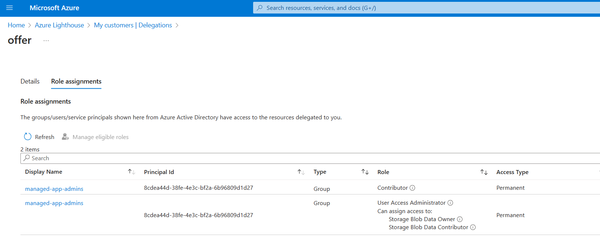

# Demo

When deploying this template, you have to select a resource group you want me to become a Contributor to.

[](https://portal.azure.com/#create/Microsoft.Template/uri/https%3A%2F%2Fraw.githubusercontent.com%2Fchgeuer%2Flighthouse-deployment%2Fmain%2Fazure-deploy.json)

## Explanations

In the Bicep file, we deploy these authorizations:

```bicep
var authorizations = [
  {
    principalId: serviceProviderPrincipalId
    principalIdDisplayName: serviceProviderPrincipalDisplayName
    roleDefinitionId: roles.Contributor
  }
  {
    principalId: serviceProviderPrincipalId
    principalIdDisplayName: serviceProviderPrincipalDisplayName
    roleDefinitionId: roles.UserAccessAdministrator
    delegatedRoleDefinitionIds: [ 
      roles.BlobDataOwner
      roles.BlobDataContributor
    ]
  }
]
```


The first entry is relatively simple, it grants the security principal from the service provider `Contributor` rights via the `roleDefinitionId` attribute. Please not you cannot assign `Owner` privileges, which is way too broad.

The second entry is more interesting: The principal is a `UserAccessAdministrator`, i.e. it can create RBAC assignments, but only for the `BlobDataOwner` and `BlobDataContributor` roles. 

When looking in the service provider tenant, we can see these RBAC assignments, i.e. our principal is Contributor, and a User Access Administrator who can assign `Storage Blob Data Owner` and `Storage Blob Data Contributor`.


